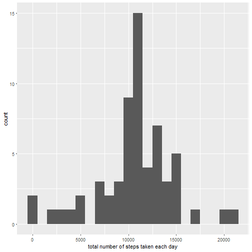
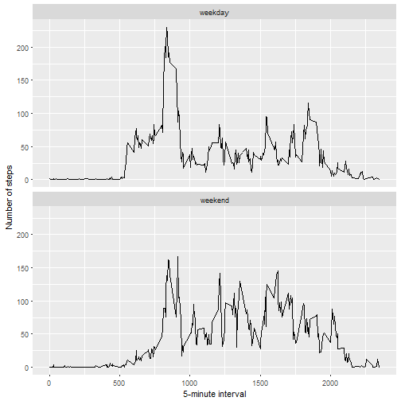

---
output:
  html_document: default
  keep_md: true
---
---
title: "Reproducible research course project 1"
author: "Sreeya Sreevatsa"
date: "July 27, 2017"
output: html_document

## Loading and preprocessing the data

```r
data <- read.csv("activity.csv")
```

## What is mean total number of steps taken per day?

```r
library(ggplot2)
total.steps <- tapply(data$steps, data$date, FUN = sum, na.rm = TRUE)
qplot(total.steps, binwidth = 1000, xlab = "total number of steps taken each day")
```


##### Calculate and report the mean and median of the total number of steps taken per day

```r
mean(total.steps, na.rm = TRUE)
```

```
## [1] 9354.23
```

```r
median(total.steps, na.rm = TRUE)
```

```
## [1] 10395
```

## What is the average daily activity pattern?

```r
library(ggplot2)
averages <- aggregate(x = list(steps = data$steps), by = list(interval = data$interval), 
    FUN = mean, na.rm = TRUE)
ggplot(data = averages, aes(x = interval, y = steps)) + geom_line() + xlab("5-minute interval") + 
    ylab("average number of steps taken")
```


##### Which 5-minute interval, on average across all the days in the dataset, contains the maximum number of steps?

```r
averages[which.max(averages$steps), ]
```

```
##     interval    steps
## 104      835 206.1698
```

## Imputing missing values
##### Calculate and report the total number of missing values in the dataset 

```r
missing <- sum(is.na(data$steps))
missing
```

```
## [1] 2304
```
##### Devise a strategy for filling in all of the missing values in the dataset. 

```r
fill.value <- function(steps, interval) {
    filled <- NA
    if (!is.na(steps))
        filled <- c(steps)
    else
        filled <- (averages[averages$interval==interval, "steps"])
    return(filled)
}
```

##### Create a new dataset that is equal to the original dataset but with the missing data filled in.

```r
filled.data <- data
filled.data$steps <- mapply(fill.value, filled.data$steps, filled.data$interval)
```

##### Make a histogram of the total number of steps taken each day and Calculate and report the mean and median total number of steps taken per day.

```r
total.steps <- tapply(filled.data$steps, filled.data$date, FUN=sum)
qplot(total.steps, binwidth=1000, xlab="total number of steps taken each day")
```



```r
mean(total.steps)
```

```
## [1] 10766.19
```

```r
median(total.steps)
```

```
## [1] 10766.19
```
######## The mean and median increased because the missing data have a value now. Before imputing, these missing values were considered zero.

## Are there differences in activity patterns between weekdays and weekends?

```r
weekday.or.weekend <- function(date) {
    day <- weekdays(date)
    if (day %in% c("Monday", "Tuesday", "Wednesday", "Thursday", "Friday"))
        return("weekday")
    else if (day %in% c("Saturday", "Sunday"))
        return("weekend")
    else
        stop("invalid date")
}
filled.data$date <- as.Date(filled.data$date)
filled.data$day <- sapply(filled.data$date, FUN=weekday.or.weekend)
```
##### Make a panel plot containing a time series plot

```r
averages <- aggregate(steps ~ interval + day, data=filled.data, mean)
ggplot(averages, aes(interval, steps)) + geom_line() + facet_grid(day ~ .) + facet_wrap(~day,ncol=1) +
    xlab("5-minute interval") + ylab("Number of steps")
```



###### The weekday and weekend trends are similar
